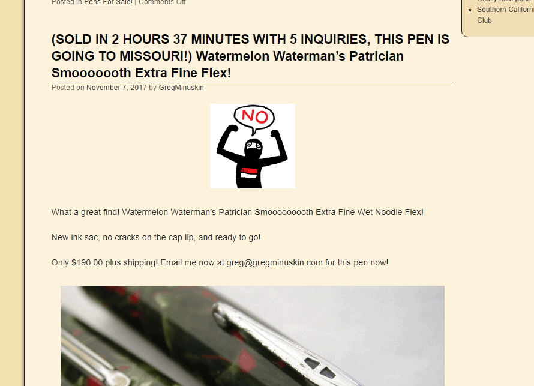
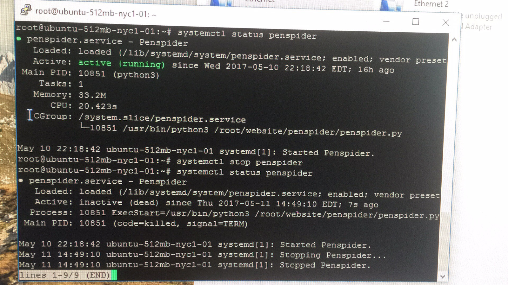
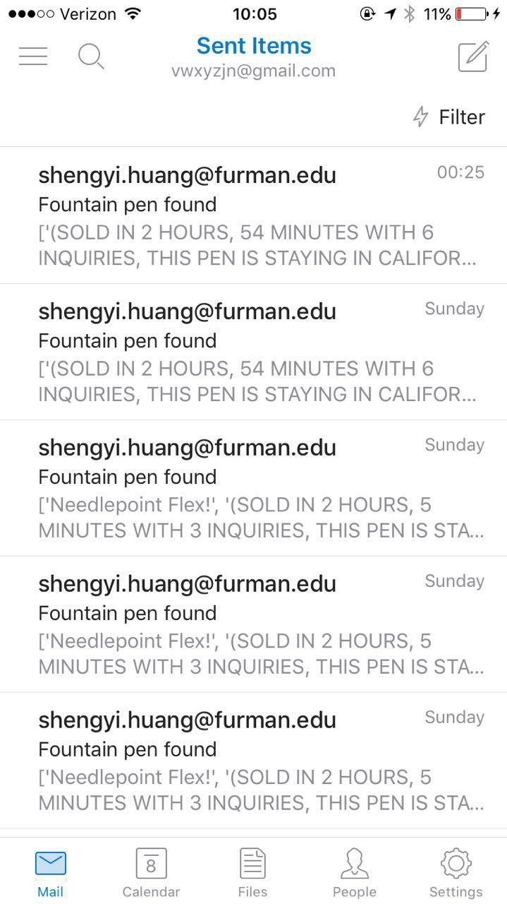

# Penspider

Penspider is a web cralwer that can crawls the fountain pens listing at [Greg Minuskin](http://gregminuskin.com/), which is a website that periodically presents vintage fountain pens for sale. Usually those new listing of fountain pens would get sold really fast, as shown in
the screenshot below:

I didn't want to check the website every once in a while, therefore I decided to write a web crawler that would do the job for me. Hence ``penspider`` is created. After deploying it on ubuntu, ``penspider`` would send me emails indicating new listing of fountain pens, as shown in
the screenshot below:

If you decide to use ``penspider``, please replace ``client_secret.json`` with your own version generated by Google. Notice the current ``client_secret.json`` in the repo has expired (so don't try to use my client_secret to do various things :) ).
